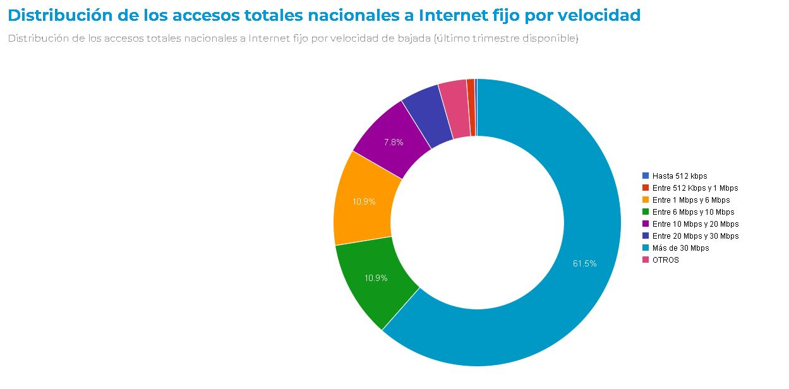

# **`Telecomunicaciones`**

### **Contexto**

La industria de las telecomunicaciones ha jugado un papel vital en nuestra sociedad, facilitando la información a escala internacional y permitiendo la comunicación continua incluso en medio de una pandemia mundial. La transferencia de datos y comunicación se realiza en su mayoría a través de internet, líneas telefónicas fijas, telefonía móvil, casi en cualquier lugar del mundo.

En comparación con la media mundial, Argentina está a la vanguardia del desarrollo de las telecomunicaciones, teniendo para el 2020 un total de [62,12 millones conexiones](https://www.datosmundial.com/america/argentina/telecomunicacion.php).


### Rol a desarrollar

En este contexto, una empresa prestadora de servicios de telecomunicaciones le encarga a usted la realización de un **análisis** completo que permita reconocer el comportamiento de este sector a nivel nacional. Considere que la principal actividad de la empresa es brindar **acceso a internet**, pero también es importante considerar el resto de los servicios.


### Objetivos

* **Conocer el tamaño del mercado y la tendencia del mismo:** Esto va a ayudar a la empresa a determinar el potencial de crecimiento y a tomar decisiones estratégicas basadas en datos.
* **Identificar las necesidades y preferencias de los clientes:** Como objetivo adicional se planteó identificar las necesidades y preferencias de los clientes y asegurarse de que los servicios ofrecidos por la empresa cumplan con los mismos
* **Incrementar el número de clientes:** Esto puede lograrse a través de estrategias de marketing y publicidad para atraer a nuevos clientes, así como también a través de la mejora de la calidad de los servicios ofrecidos para aumentar la satisfacción del cliente y la fidelización.


Con el fin de monitorear la eficacia de los objetivos de la empresa, se **visualizarán** en un dashboard los siguiente KPIs:

* Evaluar el aumento o disminución de la variación porcentual **trimestral** del servicio de internet, cada 100 hogares por provincia.
* Evaluar el nivel de penetración del mercado de los servicios de Telecomunicaciones
* Evolución de la velocidad media de descarga
* Evolución de accesos a Internet por tecnología
* Localidades sin servicio de Internet

### Análisis Exploratorio de los datos

Analizando la información disponible decidimos utilizar los siguientes datasets para cumplir con los objetivos planteados:





Para importar la información en POWER BI utilizamos el siguiente script de python:

```
import pandas as pd
import requests

# Accedo directamente al CSV ya que la api no devuelve los datasets de las visualizaciones
internet_penet_prov = pd.read_csv("https://datosabiertos.enacom.gob.ar/rest/datastreams/275028/data.csv")
internet_penet = pd.read_csv("https://datosabiertos.enacom.gob.ar/rest/datastreams/281491/data.csv")
internet_tec = pd.read_csv("https://datosabiertos.enacom.gob.ar/rest/datastreams/275029/data.csv")
internet_vel = pd.read_csv("https://datosabiertos.enacom.gob.ar/rest/datastreams/288059/data.csv")
internet_acc_vel = pd.read_csv("https://datosabiertos.enacom.gob.ar/rest/datastreams/280921/data.csv")
internet_map = pd.read_csv("https://datosabiertos.enacom.gob.ar/rest/datastreams/277615/data.csv")

# Accedo mediante la API
response = requests.get("http://api.datosabiertos.enacom.gob.ar/api/v2/datastreams/ACCES-A-INTER-FIJO-POR/data.ajson/?auth_key=9yZFM9svSV3I2epH4ZPwDxtNuXvnoEI8xveLiwiv")
data = response.json()
internet_tec_prov = data["result"]
# Convierto la primer file en el nombre de las columnas
internet_tec_prov = pd.DataFrame(internet_tec_prov)
internet_tec_prov.columns = internet_tec_prov.iloc[0]
internet_tec_prov = internet_tec_prov[1:]

response = requests.get("http://api.datosabiertos.enacom.gob.ar/api/v2/datastreams/PENET-TOTAL-NACIO-DE-LA/data.ajson/?auth_key=9yZFM9svSV3I2epH4ZPwDxtNuXvnoEI8xveLiwiv")
data = response.json()
telefonia = data["result"]
# Convierto la primer file en el nombre de las columnas
telefonia = pd.DataFrame(telefonia)
telefonia.columns = telefonia.iloc[0]
telefonia = telefonia[1:]

response = requests.get("http://api.datosabiertos.enacom.gob.ar/api/v2/datastreams/PENET-TOTAL-NACIO-DE-55233/data.ajson/?auth_key=9yZFM9svSV3I2epH4ZPwDxtNuXvnoEI8xveLiwiv")
data = response.json()
television = data["result"]
# Convierto la primer file en el nombre de las columnas
television = pd.DataFrame(television)
television.columns = television.iloc[0]
television = television[1:]
```

En la tabla "Acceso a Internet fijo por Tecnología y Provincia" hubo que corregir algunos valores con error para poder convertirlos a numéricos:

```
let
    Origen = Python.Execute("import pandas as pd#(lf)import requests#(lf)#(lf)response = requests.get(""http://api.datosabiertos.enacom.gob.ar/api/v2/datastreams/ACCES-A-INTER-FIJO-POR/data.ajson/?auth_key=9yZFM9svSV3I2epH4ZPwDxtNuXvnoEI8xveLiwiv"")#(lf)data = response.json()#(lf)internet_tec_prov = data[""result""]#(lf)# Convierto la primer file en el nombre de las columnas#(lf)internet_tec_prov = pd.DataFrame(internet_tec_prov)#(lf)internet_tec_prov.columns = internet_tec_prov.iloc[0]#(lf)internet_tec_prov = internet_tec_prov[1:]"),
    internet_tec_prov1 = Origen{[Name="internet_tec_prov"]}[Value],
    #"Valor reemplazado" = Table.ReplaceValue(internet_tec_prov1,"*","",Replacer.ReplaceText,{"Año", "Trimestre", "Provincia", "ADSL", "Cablemodem", "Fibra óptica", "Wireless", "Otros", "Total"}),
    #"Valor reemplazado1" = Table.ReplaceValue(#"Valor reemplazado","- 0","0",Replacer.ReplaceText,{"Año", "Trimestre", "Provincia", "ADSL", "Cablemodem", "Fibra óptica", "Wireless", "Otros", "Total"}),
    #"Tipo cambiado" = Table.TransformColumnTypes(#"Valor reemplazado1",{{"Año", Int64.Type}, {"Trimestre", Int64.Type}, {"ADSL", Int64.Type}, {"Cablemodem", Int64.Type}, {"Fibra óptica", Int64.Type}, {"Wireless", Int64.Type}, {"Otros", Int64.Type}, {"Total", Int64.Type}}),
    #"Filas inferiores quitadas" = Table.RemoveLastN(#"Tipo cambiado",1)
in
    #"Filas inferiores quitadas"
```

Además en cada una de las tablas utilizadas se agregó la columna "Fecha" para poder ordenar los valores. La misma se creó en base a las columnas "Año" y "Trimestre" de cada tabla:

```
Fecha = DATE([Año],([Trimestre]-1)*3+3,1)
```

### Informe

Para visualizar el informe realizado, acceder al archivo "Informe.pbix" dentro del repositorio
